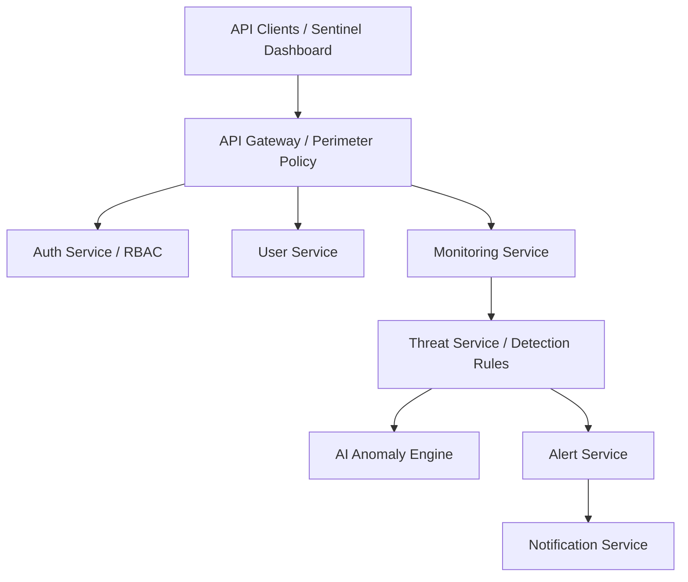

# Sentinel Security Platform

Sentinel is an enterprise-grade, AI-ready API security, identity governance, and real-time threat monitoring platform designed for high-throughput cloud environments.

---

## Table of Contents

- [Project Overview](#project-overview)
- [Architecture](#architecture)
- [Repository Structure](#repository-structure)
- [Technology Stack](#technology-stack)
- [Getting Started](#getting-started)
- [Build Instructions](#build-instructions)
- [Roadmap](#roadmap)
- [License](#license)

---

## Project Overview

Sentinel offers a unified defense ecosystem against modern API security vulnerabilities, automated bot attacks, unauthorized data access, and suspicious access anomalies.

### Key Capabilities
- **Authentication & Identity Management**: JWT access token issuance, SHA-256 hashed refresh-token rotation, BCrypt password validation, and granular RBAC.
- **Audit Event Logging**: Comprehensive security event tracking with structured payload metadata and persistence.
- **AI Threat Engine**: Anomaly detection and real-time telemetry analysis for suspicious activity scoring.
- **Enterprise Infrastructure**: Microservices-ready design with Docker Compose, Kubernetes orchestration schemas, and Prometheus/Grafana monitoring targets.

---

## Architecture

Sentinel is organized as a domain-driven monorepo separating runtime microservices, frontend dashboards, machine learning engines, and DevOps infrastructure:



Detailed architectural specifications, ADRs, sequence diagrams, and C4 models can be found under [`docs/architecture/`](docs/architecture/SystemDesign/architecture.md).

---

## Repository Structure

```text
Sentinel/
├── pom.xml                        # Root Aggregator POM
├── backend/                       # Spring Boot Microservices & Shared Libraries
│   ├── pom.xml                    # Backend Parent POM
│   ├── common-library/            # Shared API response, error & security event contracts
│   ├── auth-service/              # Spring Boot JWT & RBAC Authentication Service
│   ├── gateway-service/           # Perimeter Gateway & Routing Policies
│   ├── user-service/              # User Administration Context
│   ├── monitoring-service/        # API Telemetry Ingestion Context
│   ├── threat-service/            # Threat Detection & Scoring Engine
│   ├── alert-service/             # Alert Escalation Policy Manager
│   ├── notification-service/      # Multi-channel Notification Delivery
│   ├── report-service/            # Compliance & Analytics Reporting
│   ├── config-server/             # Future Spring Cloud Config Server
│   ├── service-discovery/         # Future Service Discovery (Eureka/Consul)
│   ├── api-gateway/               # Future Unified API Gateway
│   ├── common-security/           # Future Shared JWT & Security Filter Library
│   └── shared-kernel/             # Future Shared Domain Models & DTOs
├── frontend/
│   └── sentinel-dashboard/        # Sentinel Management Dashboard (Web App)
├── ai-engine/                     # Machine Learning & Anomaly Detection Pipeline
│   ├── anomaly-detection/         # Real-time Inference Modules
│   ├── training/                  # Offline Model Training Scripts
│   ├── models/                    # Serialized Model Artifacts
│   ├── datasets/                  # Training & Validation Telemetry Datasets
│   ├── pipelines/                 # Data Preprocessing & Feature Extraction
│   ├── experiments/               # Experimentation & Hyperparameter Logs
│   ├── requirements.txt           # Python ML Dependencies
│   └── README.md                  # AI Engine Documentation
├── infrastructure/                # Deployment & DevOps Tooling
│   ├── docker/                    # Docker Compose Specifications
│   ├── kubernetes/                # Helm & Manifest Specs
│   ├── terraform/                 # Infrastructure as Code
│   ├── monitoring/                # Prometheus & Grafana Rules
│   └── logging/                   # ELK Stack & Log Aggregation Configs
├── docs/                          # Enterprise Platform Documentation
│   ├── architecture/              # ADRs, C4 Models, Sequence Diagrams & Threat Models
│   ├── api/                       # OpenAPI & Endpoint Specs
│   ├── deployment/                # Environment Setup & Deployment Guides
│   ├── database/                  # Schema Migrations & ER Diagrams
│   ├── security/                  # Security Audits & Compliance Policies
│   ├── sprints/                   # Sprint Planning & Release Notes
│   └── user-guide/                # Platform Operator Documentation
├── .github/
│   └── workflows/                 # CI/CD GitHub Actions Workflows
├── scripts/                       # Operational & Helper Scripts
├── .env.example                   # Environment Variables Specification
├── .gitignore                     # Git Exclusion Rules
├── LICENSE                        # MIT License
└── README.md                      # Platform Architecture Documentation
```

---

## Technology Stack

- **Backend**: Java 21, Spring Boot 3.3.5, Spring Security, Spring Data JPA, Flyway, PostgreSQL 16, Redis 7, JUnit 5, Testcontainers.
- **AI & Analytics**: Python 3.11+, PyTorch, Scikit-Learn, Pandas, NumPy, FastAPI.
- **DevOps & Infrastructure**: Maven 3.9+, Docker Compose, Kubernetes, GitHub Actions CI/CD.

---

## Getting Started

### Prerequisites

- **Java Development Kit**: JDK 21+
- **Build Tool**: Apache Maven 3.9+
- **Container Runtime**: Docker & Docker Compose

### Environment Configuration

Copy `.env.example` to create local environment variables:

```bash
cp .env.example .env
```

Configure strong database passwords and a valid `JWT_SECRET` (at least 32 bytes).

---

## Build Instructions

### 1. Compile & Verify Full Monorepo (Root Aggregator)

```powershell
mvn clean verify
```

### 2. Compile & Install Backend Services Only

```powershell
cd backend
mvn clean install
```

### 3. Run Auth Service Locally

```powershell
# Using helper script:
.\scripts\run-auth-service.ps1

# Or via Maven:
cd backend
mvn -pl auth-service -am spring-boot:run
```

### 4. Run With Docker Compose

```powershell
docker compose -f infrastructure/docker/docker-compose.yml --env-file .env up --build
```

Access Swagger UI documentation at `http://localhost:8081/swagger-ui/index.html`.

---

## Roadmap

- [x] **Sprint 1**: Auth Service bounded context, JWT authentication, RBAC, Flyway migrations, and monorepo restructuring.
- [ ] **Sprint 2**: Gateway Service routing, rate limiting policies, and token relay integration.
- [ ] **Sprint 3**: Telemetry ingestion pipeline and Monitoring Service.
- [ ] **Sprint 4**: AI Threat Detection Engine integration with real-time scoring.
- [ ] **Sprint 5**: Alerting escalation, notification dispatchers, and frontend dashboard launch.

---

## License

This project is licensed under the [MIT License](LICENSE).
